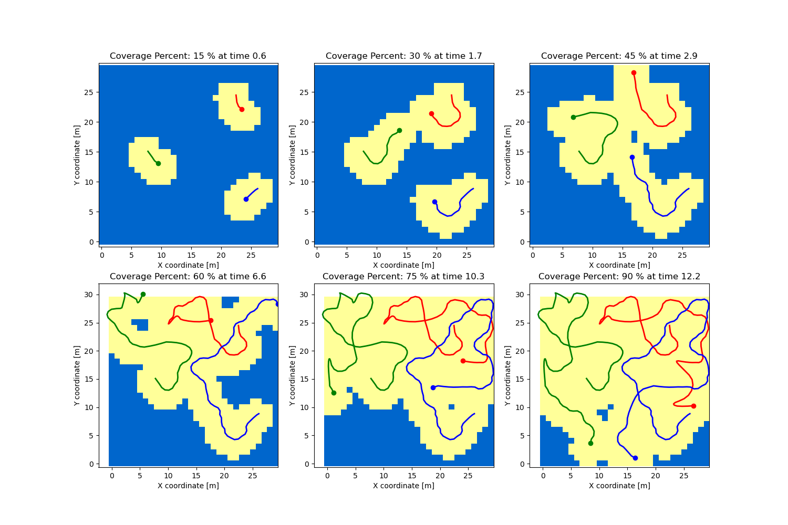
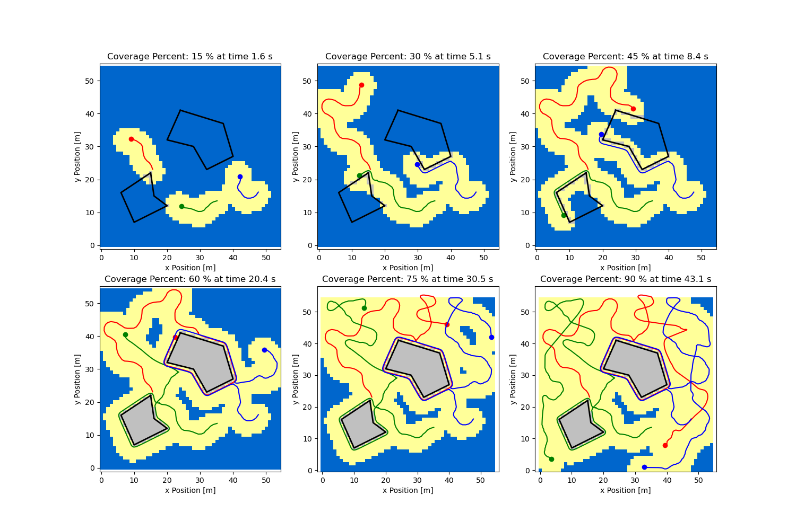
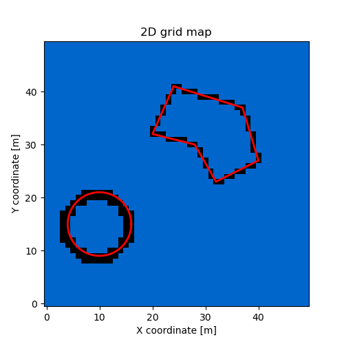
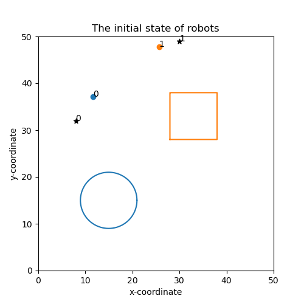

# Area-Coverage-Path-Planing
This repo contains the implementation of my master thesis. 
## The implementation work includes: 
- Anti-flocking multi-robot coodination
- Free space exploration with multiple robots 
- Modified bug_algorithm 
- Obstacle circumbavigation 
- Path and motion animation 

## File structure 

## Some results 
### Area coverage without obstacles 
<div align=center></div>

### Area coverage with obstacles 
<div align=center></div>

## Animations

## Usage 

### Create a 2D grid map with obstacles 

```Python
from env_map import *
mymap = EnvMap(50,50, 1) # create [50x50] 2D grid map with cell size 1 
mymap.add_circle(10, 15, 6) # add a circle obstacle at position [10,15] with radius 6
mymap.add_polygon([24,41,37,37,40,27,32,23,28,30,20,32]) # add a polygon obstacle by defining its vertices 
mymap.show_map() # show the map 

```
<div align=center></div>

### Define a group of agents with predefined parameters 
```Python
from robot import *
robot_number=3
robotList = define_robot(robot_number) # define a group of 3 robots and store the robot object in a list 
for robot in robotList:
    robot.random_init_state(mymap) # initialize their position 
    robot.random_init_target() # initialize their target 
show_robot(robotList, mymap) # show the initial states and target on the map 
```
<div align=center></div>

