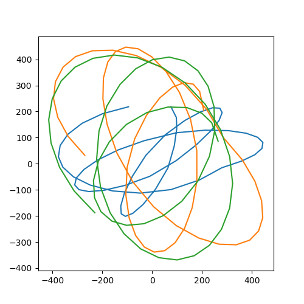
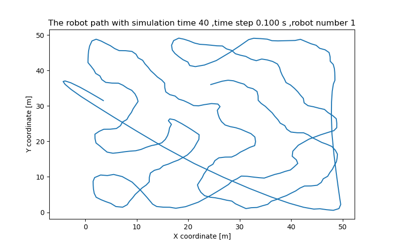
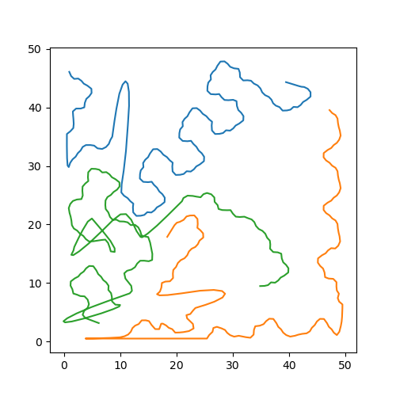

# Area-Coverage-Path-Planing
This repo contains the implementation of my master thesis. 
##The implementation work includes: 
- Anti-flocking multi-robot coodination
- Free space exploration with multiple robots 
- Modified bug_algorithm 
- Obstacle circumbavigation 
- Path and motion animation 
- ROS simulation 

##Some results 

##Animation 
<video id="video" controls="" preload="none" poster="封面">
      <source id="mp4" src="image/robot_path_animation11.mp4" type="video/mp4">
</videos>
