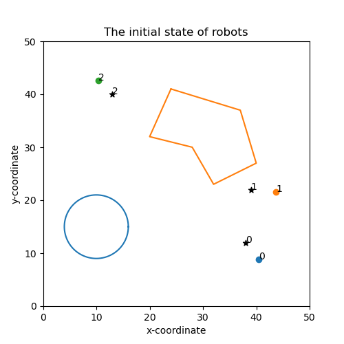

# Area-Coverage-Path-Planing
This repo contains the implementation of a project: Conceptualization and Implementation of a Novel Area Coverage
Path Planning for Multiple Mobile Robots. Multi-agent systems (MASs) have been investigated intensively by scholars from different disciplines, such as computer science, biology, and civil engineering.  Area coverage and mapping of an agricultural field is a crucial step towards precision agriculture. In this repo, a distributed area coverage control and mapping framework is proposed to explore and map an unknown 2D environment with multiple agents. Tangent Bug, together with a flood fill inspired algorithm is utilized to circumnavigate and recognize the restricted area in the environment. The proposed framework is easy-scalable with respect to the number of agents, adaptable to environmental changes, and simple to implement.
Keywords: Multi-agent system, online area coverage, path planning, cooperative control. 
## The implementation work includes: 
- Anti-flocking multi-robot area coverage path planning 
- Domain exploration with and without obstacles 
- Tangent Bug circumnavigation algorithm  
- Flood-Fill algoorithm 
- Plots and robot motion animation 

## File structure 
    .
    ├── docs                    # important reference paper                  
    ├── image                   # simulation results 
    ├── data                    # store the coverage percent data
    ├── scripts                
    │   ├── env_map.py          # create 2D grid map with obstacles     
    │   ├── robot.py            # create Robot object with predefined parameters         
    │   ├── floodFill.py        # flood-fill algorith  to fill the inner area of an obstacle 
    │   ├── methods.py          # functions such as sigma-norm adjacency matirx 
    │   ├── global_value.py     # define the parameters for robots and simulations 
    │   ├── save_value.py       # save the evolution of the coverage percent value from each simulation 
    │   ├── robot_animation.py  # animate the robot motion 
    │   ├── tangentbug.py       # Tangent Bug algorithm for circumnavigation 
    │   └── pathPlanning.py     # the whole framework 
    ├── tests
    └── ...
## Requirements 
- numpy
- math
- matplotlib 
- scipy
- ffmpeg-python 
## Some results 
### Area coverage without obstacles 
<div align=center></div>

### Area coverage with obstacles 
<div align=center></div>

## Structure of the pathPlanning.py file 
The simulation is conducted by running the pathPlanning.py file in the scripts folder. 
<div align=center></div>

## Usage 
The pathPlanning.py file can be modified by the user to add robots and define obstacles. 

### Create a 2D grid map with obstacles 

```Python
from env_map import *
mymap = EnvMap(50,50, 1) # create [50x50] 2D grid map with cell size 1 
mymap.add_circle(10, 15, 6) # add a circle obstacle at position [10,15] with radius 6
mymap.add_polygon([24,41,37,37,40,27,32,23,28,30,20,32]) # add a polygon obstacle by defining its vertices 
mymap.show_map() # show the map 

```
<div align=center></div>

### Define a group of agents with predefined parameters 
```Python
from robot import *
robot_number=3
robotList = define_robot(robot_number) # define a group of 3 robots and store the robot object in a list 
for robot in robotList:
    robot.random_init_state(mymap) # initialize their position 
    robot.random_init_target() # initialize their target 
show_robot(robotList, mymap) # show the initial states and target on the map 
```
<div align=center></div>

### Set up the simulation values 
The robot parameters, simulation time and stepsize can be set up in the global_value.py 
```Python
# simulation parameters
robot_number=3
random_initial_state=1  # the robots are randomly initialized in the environment if 1, otherwise a manual initialization has to be done 
coverage_percent=0.95  # simulation will terminate if coverage percent achieved  
T=120  # total simulation time. hard break out condition to prevent infinite loop 
step_size=0.1 # size of each step

```
### Activate desired plot-functions 
```Python
filename=save_variable(c_percent[:time],'../data/coverage_percent')  #save the c_percent data to file in data folder 
plot_coverage_percent(c_percent, time) # plot the evolution of the coverage percent
plot_robot_path(robotList, mymap, time) # plot the robot path
anim = visualize_motion(robotList, mymap, time) # show 2D animation
plot_path_on_infomap(robot_path_shot_list, merged_infomap_shot_list, mymap) # plot the snap shot of the trajectory 
single_path_on_infomap(robotList, mymap, time) # plot the final result of the path planng together with the generated information map 

```

### Run the simulation 
Run the pathPlanning.py script to start the simulation. 


