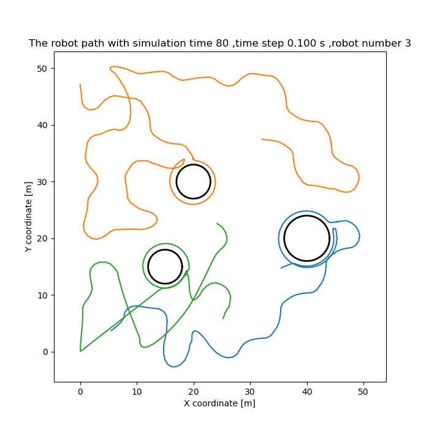

# Area-Coverage-Path-Planing
This repo contains the implementation of my master thesis. 
## The implementation work includes: 
- Anti-flocking multi-robot coodination
- Free space exploration with multiple robots 
- Modified bug_algorithm 
- Obstacle circumbavigation 
- Path and motion animation 
- ROS simulation 

## Some results 

## Animations
